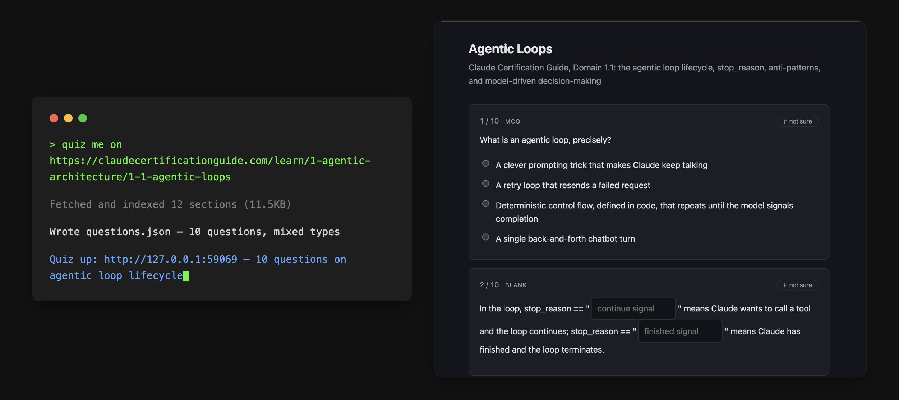

# AnyQuiz



An agent skill for ad-hoc interactive quizzes to let your agent coach you through a quiz. Your agent writes a quiz mid-conversation, you take it in the browser, and your answers flow back into the same session so it can grade the open-ended ones and coach you through the misses.

Anything in the agent's context can be used to create a quiz.

Ships as an agent skill across multiple harnesses. Requires Node 22.

## Install

Supported harnesses:

- **Claude Code**

  ```
  claude plugin marketplace add christopherarter/any-quiz
  claude plugin install any-quiz@any-quiz
  ```

- **[Pi](https://pi.dev)**

  ```
  pi install git:github.com/christopherarter/any-quiz
  ```

- **[Codex](https://developers.openai.com/codex)** — no package installer for skills; it scans `.agents/skills` (repo or `~/.agents/skills`) and follows symlinks:

  ```
  git clone https://github.com/christopherarter/any-quiz /path/to/any-quiz
  mkdir -p ~/.agents/skills
  ln -s /path/to/any-quiz/codex-skills/any-quiz ~/.agents/skills/any-quiz
  ```

Then ask your agent to quiz you on something.

### Local models (Ollama / LM Studio)

The quiz logic never calls an LLM itself — authoring and grading are done by whatever model drives the harness — so running against a local model is a harness choice, not a code change. Codex's OSS mode is a verified path:

```
codex --oss --local-provider=ollama -m <model>     # or --local-provider=lmstudio
```

(Plain `--oss` without a provider errors on current Codex; alternatively set `oss_provider = "ollama"` in `~/.codex/config.toml`.)

Two things to know:

- **Sandbox.** The skill writes quiz folders to `~/.any-quiz/` and binds a localhost port, both outside Codex's default sandbox. Interactively, approve the prompts when asked; non-interactively, use a `workspace-write` profile with network access enabled and `~/.any-quiz` in `writable_roots`.
- **Model size.** Authoring means producing JSON the validator accepts and then following a multi-step procedure. Verified end-to-end with a 27B model (authored a valid quiz first try, graded and coached correctly); models much smaller than that may trip the validator or skip procedure steps.

## Question types

- **Multiple choice** — pick one answer from a list.
- **Multi-select** — pick every correct answer from a list.
- **Fill in the blank** — fill in one or more blanks in a prompt; close synonyms count.
- **Matching** — pair items from one list to another.
- **Short answer** — answer in your own words. Your agent grades this one after you submit.
- **Code** — write a code answer. Your agent grades this one after you submit.

Any question can be flagged "not sure," and that flag is reported alongside the answer — a right answer someone flagged is worth more coaching than a right answer they were sure of.

See `skills/any-quiz/SKILL.md` for the authoring schema.

## Harnesses

The quiz logic (`bin/any-quiz.mjs`, plain Node, no harness dependency) is shared; only the skill adapter and its install manifest differ per harness:

| Harness | Skill | Manifest |
|---|---|---|
| Claude Code | `skills/any-quiz/SKILL.md` | `.claude-plugin/` |
| Pi | `pi-skills/any-quiz/SKILL.md` | `pi` key in `package.json` |
| Codex | `codex-skills/any-quiz/SKILL.md` | symlink into `.agents/skills` |

Adapters differ only where the harness forces it — path to `bin/any-quiz.mjs` (Claude Code resolves it via `${CLAUDE_PLUGIN_ROOT}`; Pi and Codex have no such variable, so their skills use a path relative to the skill directory) and how a long-lived process is run (Claude Code backgrounds it and waits for the exit notification; Pi and Codex have no confirmed background-bash equivalent, so their versions run the command in the foreground and block on it). Everything else — the procedure, schema, coaching instructions — is copied as-is.

To add a harness: drop `<harness>-skills/any-quiz/SKILL.md`, adjust only what that harness's skill/process conventions force, wire it into that harness's own manifest convention, and add a row to the table above. Full process in `.claude/skills/harness-ports/SKILL.md`.

## Layout

Each quiz is a folder under `~/.any-quiz/`:

    2026-08-17-rust-lifetimes-a3f9/
      meta.json       title, topic, follow-up lineage
      questions.json  prompts plus the answer key
      answers.json    your responses, written as you go

The answer key lives in `questions.json` but is stripped before anything reaches the browser, and the browser is typed against `PublicQuestion` so reading it is a compile error.

Submitting closes the attempt. Re-serving the same folder needs `--retake`, which archives the finished attempt rather than overwriting it.

## Develop

    npm install
    npm run check      # lint, typecheck, test

    npm run dev:api    # terminal 1 — API on :4711
    npm run dev:web    # terminal 2 — Vite with HMR, proxies /api

`app/dist/` and `bin/any-quiz.mjs` are committed so every harness adapter ships with nothing to install beyond itself. **Run `npm run build` and commit the result whenever you change anything under `app/`, `lib/`, or `serve.ts`** — a Vitest check fails if either bundle is stale.

To try the plugin from a local clone without publishing it, point Claude Code at the working copy directly: `claude plugin marketplace add /path/to/any-quiz && claude plugin install any-quiz@any-quiz`.
